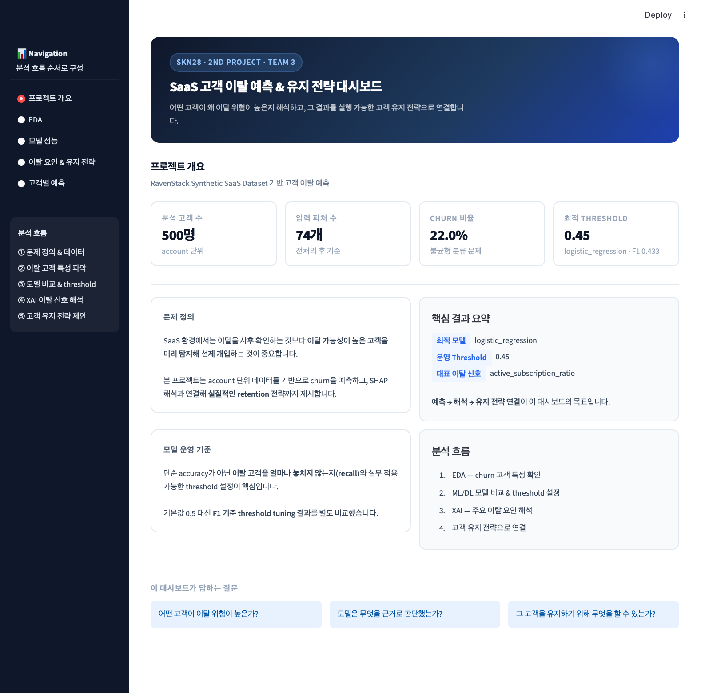

# SKN28-2nd-3Team

<!-- README 앞부분: 팀 이미지 + 팀 소개 -->
<!-- 팀 이미지 수평 배치 -->
# 👥 팀 소개
## 1) 팀명: ㄱㅅ(감사)
#### 팀원들 이름의 초성 `ㄱㄱㄱㅅㅅ(김김김손송)`을 중복 제거 → `ㄱㅅ(감사)`  


## 2) 팀원 소개


# 설명 가능한 AI 기반 SaaS 고객 이탈 예측 및 고객 유지 전략 제안

---

## 프로젝트 개요

| 항목 | 내용 |
|------|------|
| 주제 | 설명 가능한 SaaS 고객 이탈 예측 및 고객 유지 전략 분석 |
| 데이터셋 | RavenStack Synthetic SaaS Dataset |
| 분석 단위 | account 기준 (500개) |
| 입력 변수 수 | 74개 (전처리 후 학습 테이블 기준) |
| Churn 비율 | 22.0% (불균형 분류 문제) |
| 최적 운영 기준 | threshold 0.45 (logistic_regression · F1 0.433) |
| 배포 | [🔗 Streamlit 대시보드](https://skn28-2nd-3teamgit.streamlit.app/) |

### 프로젝트 목표
- 비즈니스 이해를 통한 머신러닝 모델 활용 계획 수립
- 머신러닝 모델 구축을 위한 데이터셋 준비 및 전처리
- 머신러닝 모델과 딥러닝 모델 학습 및 평가
- 평가를 통한 성능이 좋은 최적의 모델 설정 및 배포

---

## 프로젝트 흐름

```
① 문제 정의 → ② 이탈 고객 특성 파악 → ③ 예측 모델 비교 및 threshold 조정 → ④ XAI 기반 주요 이탈 신호 해석 → ⑤ 고객 유지 전략 제안
```

| 단계 | 내용 |
|------|------|
| ① 문제 정의 | SaaS 환경에서 이탈 고객 선제 탐지의 필요성 및 분석 방향 설정 |
| ② 이탈 고객 특성 파악 | EDA를 통한 churn/non-churn 고객 비교 및 주요 변수 탐색 |
| ③ 예측 모델 비교 및 threshold 조정 | ML/DL 모델 학습·비교, 운영 기준 threshold 탐색 |
| ④ XAI 기반 주요 이탈 신호 해석 | SHAP으로 모델 판단 근거 및 이탈 요인 해석 |
| ⑤ 고객 유지 전략 제안 | 예측·해석 결과를 실행 가능한 retention 전략으로 연결 |

---

## 문제 정의

SaaS 환경에서는 이미 이탈한 고객을 사후적으로 분석하는 것보다,  
이탈 가능성이 높은 고객을 미리 탐지하고 선제적으로 대응하는 것이 더 중요하다.

이 프로젝트는 account 단위 데이터를 통합하여 churn을 예측하고,  
예측 결과를 SHAP 기반 설명과 연결하여  
최종적으로는 실무적으로 활용 가능한 retention 전략까지 제시하는 구조로 설계하였다.

---

## 사용 기술

| 분류 | 기술 |
|------|------|
| Language | Python |
| Data Processing | pandas, numpy |
| Visualization | matplotlib, seaborn, plotly |
| Modeling | scikit-learn, xgboost |
| Deep Learning | PyTorch |
| Explainable AI | SHAP |
| Dashboard | Streamlit |

---

## 데이터 설명

### 데이터 출처
RavenStack Synthetic SaaS Dataset (Kaggle)

### 테이블 구조

| 파일명 | 분석 단위 | 행 수 | 주요 내용 | 용도 |
|--------|-----------|-------|-----------|------|
| `accounts.csv` | account | 500 | 고객 계정 마스터 정보 | 기본 식별 및 조인 키 |
| `subscriptions.csv` | account | 5,000 | 구독 이력 및 플랜 정보 | 구독 상태·플랜 변화 파악 |
| `feature_usage.csv` | subscription | 25,000 | 기능별 사용 로그 | 사용량 기반 이탈 신호 탐지 |
| `support_tickets.csv` | account | 2,000 | 지원 티켓 이력 | 불만·오류 경험 반영 |
| `churn_events.csv` | account | 600 | 사후 이탈 이벤트 정보 | **예측 제외 / 원인 분석 전용** |

> ⚠️ `churn_events`는 이탈 이후 데이터이므로 예측 모델 학습에서 의도적으로 제외 → **데이터 누수 방지**  
> ⚠️ `feature_usage`는 subscription 단위이므로 account 단위로 집계 후 조인

### 타깃 변수

- **컬럼명**: `churn_flag` (`accounts.csv`)
- **분포**: Non-churn 390건 (78%) / Churn 110건 (22%)
- 클래스 불균형 존재 → `class_weight` 및 threshold 튜닝으로 대응

---

## EDA 요약

### 타깃 분포
- Non-Churn: **390건** / Churn: **110건** (22.0%) → 불균형 분류 문제

### churn 여부별 주요 변수 평균 차이 (상위 항목)

| feature | non_churn_mean | churn_mean | diff |
|---------|---------------|------------|------|
| total_usage_duration_secs | 150,350 | 158,347 | +7,996 |
| account_age_days | 329.4 | 371.7 | +42.2 |
| max_subscription_duration_days | 294.2 | 329.8 | +35.6 |
| total_usage_count | 495.1 | 522.0 | +26.9 |
| avg_subscription_duration_days | 154.4 | 172.9 | +18.5 |
| health_score | 10.02 | 10.15 | +0.13 |
| escalation_ratio | 0.043 | 0.061 | +0.018 |

> 이탈 고객이 오히려 사용량·가입 기간이 더 높게 나타남 → 단순 사용량 감소보다 **복합 패턴**이 이탈을 설명함을 시사

### 주요 시각화 인사이트
- **상관관계 heatmap**: `total_subscriptions` ↔ `active_subscriptions`, `total_usage_count` ↔ `total_usage_duration_secs` 등 강한 양의 상관 확인 → 다중공선성 주의
- **사용량 평균 비교**: Churn 고객(522) > Non-Churn(495) → 사용량 단독으로 이탈 예측 어려움
- **health_score 평균 비교**: Churn(10.15) ≈ Non-Churn(10.02) → health_score의 단독 변별력 낮음, 복합 변수로 활용 필요
- 이탈 원인(`churn_events`) 분포: 기능 부족(114건) > 지원 불만(104건) > 예산(104건) 순

---

## ⚙️ 데이터 전처리

### 결측치 처리
- 단순 제거 대신 **값 대체(imputation) + 결측 플래그 변수** 병행
- `satisfaction_score` 결측 자체를 이탈 신호로 활용

### 인코딩 / 스케일링
- 범주형 변수: Label Encoding / One-Hot Encoding
- 수치형 변수: StandardScaler

### 데이터 분리 전략
- 예측 모델은 **이탈 이전 시점 데이터만으로 학습**
- `churn_events`는 원인 분석 전용으로 분리

---

## 모델링

### 사용 모델

| 모델 | 역할 |
|------|------|
| Logistic Regression | 선형 기준선 확보, 계수 해석 가능 |
| Random Forest | 비선형 패턴 포착, SHAP 연계 기준 모델 |
| MLP (PyTorch) | 비선형 상호작용 반영 가능성 검토 (확장 실험) |

> DL(MLP) 실험은 성능 우위보다 ML과의 비교를 통한 비선형 패턴 반영 가능성 검토에 의미를 두었다.

---

## 성능 비교

### 기본 threshold(0.5) 기준

| 모델 | Accuracy | Precision | Recall | F1 | ROC-AUC |
|------|----------|-----------|--------|----|---------|
| DL_MLP | 0.7867 | 0 | 0 | 0 | 0.4322 |
| Random Forest | 0.2267 | 0.2267 | 1.0 | 0.3696 | 0.3976 |
| Logistic Regression | 0.24 | 0.197 | 0.7647 | 0.3133 | 0.3256 |

> ⚠️ DL_MLP는 threshold 0.5 기준 이탈을 전혀 탐지 못함 (precision=0, recall=0)  
> ⚠️ Random Forest는 recall=1.0이나 precision이 극히 낮아 실운영 부적합

### Threshold 튜닝 후 최적 결과

| 항목 | 값 |
|------|-----|
| 기본 성능 기준 주목 모델 | **DL_MLP** |
| 최적 threshold | **0.45** |
| 최고 F1 | **0.433** |

- 고정값 0.5 대신 **Precision / Recall / F1 변화를 함께 비교**하여 실제 운영에 더 적합한 기준 탐색
- threshold 0.45에서 DL_MLP가 F1 0.433으로 최고 성능 달성

---

## 최종 모델 선택 이유

- threshold 0.5 기준에서는 세 모델 모두 성능 불안정 → **threshold 튜닝이 핵심**
- F1 기준 최고 성능: **DL_MLP (threshold 0.45, F1 0.433)**
- 단순 accuracy가 아닌 **이탈 탐지 관점의 Recall / F1** 중심으로 평가
- 고객별 예측 화면에서는 **logistic_regression** 기준으로 해석 (설명 가능성 우선)

---

## XAI — 이탈 요인 해석

SHAP 기반 해석을 통해 모델이 고객을 왜 이탈 위험이 높다고 판단했는지 분석하였다.

| 구분 | 내용 |
|------|------|
| 대상 모델 | Tree 계열 (Random Forest) |
| Global SHAP | 전체 고객 기준 주요 이탈 요인 순위 파악 |
| Local SHAP | 개별 고객 기준 이탈 위험 이유 설명 |
| 저장 방식 | 결과를 파일로 저장 → Streamlit 대시보드 연계 |

### 주요 이탈 신호 (상위 15개 중 핵심)

| 순위 | feature | 한글명 | 중요도 | 해석 포인트 |
|------|---------|--------|--------|------------|
| 1 | `active_subscription_ratio` | 활성 구독 비율 | 0.0252 | 낮을수록 이탈 위험 ↑ |
| 2 | `error_rate` | 오류 발생 비율 | 0.0182 | 높을수록 서비스 불만 ↑ |
| 3 | `industry_DevTools` | 산업군: 개발도구 | 0.0165 | DevTools 업종 이탈률 높음 |
| 4 | `avg_first_response_time_minutes` | 평균 첫 응답 시간 | 0.0139 | 길수록 고객 지원 불만 ↑ |
| 5 | `days_since_last_usage` | 마지막 사용 이후 경과일 | 0.0138 | 길수록 이탈 위험 ↑ |
| 6 | `recent_upgrade_90d` | 최근 90일 내 업그레이드 여부 | 0.0135 | 업그레이드 경험이 유지에 긍정적 |
| 7 | `max_sub_seats` | 최대 구독 좌석 수 | 0.0124 | 좌석 수 변화는 규모 변동 신호 |
| 8 | `error_per_subscription` | 구독당 오류 수 | 0.0118 | 단순 오류율과 달리 구독 규모 보정 |
| 9 | `health_score` | 고객 헬스 스코어 | 0.0111 | 낮을수록 이탈 위험 ↑ |
| 10 | `usage_per_subscription` | 구독당 사용량 | 0.0109 | 낮을수록 구독 대비 활용도 저하 |

---

## 고객 유지 전략

예측과 해석 결과를 바탕으로 실행 가능한 retention 전략을 제안하였다.

| 대상 고객군 | 이탈 신호 | 전략 |
|------------|-----------|------|
| 활성 구독 비율 저하 고객 | `active_subscription_ratio` ↓ | 선제적 케어 및 온보딩 재지원 |
| 오류 경험 고객 | `error_rate` ↑ | 우선 대응 및 기술 지원 강화 |
| 응답 지연 고객 | `avg_first_response_time_minutes` ↑ | SLA 기준 강화 및 CS 개선 |
| 장기 미사용 고객 | `days_since_last_usage` ↑ | 리인게이지먼트 캠페인 |
| DevTools 업종 고객 | `industry_DevTools` | 업종 특화 지원 및 기능 안내 |
| threshold 기반 고위험군 | 예측 확률 ≥ 0.45 | 전담 CSM 배정 및 알림 자동화 |

---

## 배포 방법

### 실행 방법

```bash
# 패키지 설치
pip install -r requirements.txt

# Streamlit 실행
streamlit run src/app/streamlit_app.py
```

### 대시보드 구성
1. 프로젝트 개요
2. EDA: 이탈 고객 특성 탐색
3. 모델 성능 및 운영 기준
4. 이탈 요인 해석 및 고객 유지 전략
5. 고객별 예측 및 액션 제안

### 결과 화면



> 추가 캡처 이미지는 순차적으로 업데이트 예정

---

## 최종 프로젝트 구조

```text
SKN28-2nd-3Team/
├── README.md                        # 프로젝트 소개 및 실행 안내
├── requirements.txt                 # 실행에 필요한 패키지 목록
│
├── docs/                            # 프로젝트 문서 모음
│   ├── data_dictionary.md           # 변수/컬럼 설명 문서
│   ├── streamlit_guide.md           # Streamlit 구성 및 사용 가이드
│   ├── project_description.md       # 프로젝트 개요 문서
│   ├── modeling_strategy.md         # 모델링 전략 정리 문서
│   └── 발표정리.md                    # 발표용 정리 문서
│
├── data/
│   ├── raw/                         # 원천 데이터 저장 폴더
│   ├── interim/                     # 전처리 중간 산출물 저장 폴더
│   └── processed/                   # 분석·모델링용 최종 데이터 저장 폴더
│
├── assets/
│   └── images/                      # 프로젝트 이미지 리소스 폴더
│
├── outputs/
│   ├── eda/
│   │   ├── plots/                   # EDA 시각화 결과 저장 폴더
│   │   └── tables/                  # EDA 표 결과 저장 폴더
│   ├── models/                      # 학습 모델 및 성능 결과 저장 폴더
│   ├── streamlit/                   # 대시보드 출력용 결과 저장 폴더
│   └── xai/                         # SHAP/XAI 결과 저장 폴더
│
├── notebooks/
│   ├── 01_data_check.ipynb          # 원천 데이터 점검
│   ├── 02_feature_engineering.ipynb # 피처 엔지니어링
│   ├── 03_eda.ipynb                 # 탐색적 데이터 분석
│   ├── 04_ml_baseline.ipynb         # 머신러닝 베이스라인 실험
│   ├── 05_xai_analysis.ipynb        # XAI 분석
│   └── 06_dl_experiment.ipynb       # 딥러닝 실험
│
└── src/                             # 실제 실행 코드 패키지
    ├── __init__.py                  # src 패키지 초기화
    │
    ├── app/                         # Streamlit 앱 코드
    │   ├── __init__.py              # app 패키지 초기화
    │   ├── streamlit_app.py         # Streamlit 메인 실행 파일
    │   ├── sections/                # 페이지별 화면 구성 모듈
    │   │   ├── overview_section.py  # 프로젝트 개요 페이지
    │   │   ├── eda_section.py       # EDA 결과 페이지
    │   │   ├── model_section.py     # 모델 성능 페이지
    │   │   ├── prediction_section.py# 개별 예측 페이지
    │   │   └── xai_section.py       # XAI 설명 페이지
    │   └── utils/                   # 앱 내부 유틸 함수
    │       ├── formatters.py        # 표시 형식 변환 함수
    │       └── load_data.py         # 앱 데이터 로드 함수
    │
    ├── config/                      # 경로 및 설정 관리
    │   ├── __init__.py              # config 패키지 초기화
    │   ├── paths.py                 # 주요 경로 정의
    │   └── settings.py              # 공통 설정값 정의
    │
    ├── data/                        # 데이터 점검 및 전처리 코드
    │   ├── data_check.py            # 원천 데이터 점검
    │   ├── preprocess_subscriptions.py # 구독 데이터 전처리
    │   └── make_train_table.py      # 학습용 통합 테이블 생성
    │
    ├── eda/                         # 탐색적 데이터 분석 코드
    │   ├── __init__.py              # eda 패키지 초기화
    │   ├── eda_main.py              # EDA 실행 메인 스크립트
    │   ├── eda_numeric.py           # 수치형 변수 분석
    │   ├── eda_categoricals.py      # 범주형 변수 분석
    │   ├── eda_missingness.py       # 결측 패턴 분석
    │   ├── eda_by_churn.py          # churn 기준 비교 분석
    │   └── eda_visualization.py     # EDA 시각화 함수
    │
    ├── features/                    # 피처 생성 및 가공 코드
    │   ├── __init__.py              # features 패키지 초기화
    │   ├── build_features.py        # 전체 피처 생성 파이프라인
    │   ├── encode_categoricals.py   # 범주형 인코딩 처리
    │   ├── missing_flags.py         # 결측 여부 플래그 생성
    │   ├── subscription_change_features.py # 구독 변화 기반 피처 생성
    │   └── make_dl_dataset.py       # 딥러닝 입력 데이터셋 생성
    │
    ├── models/                      # 모델 학습·평가·예측 코드
    │   ├── __init__.py              # models 패키지 초기화
    │   ├── train_baseline.py        # 베이스라인 모델 학습
    │   ├── train_tree_model.py      # 트리 계열 모델 학습
    │   ├── train_dl_model.py        # 딥러닝 모델 학습
    │   ├── evaluate.py              # 모델 성능 평가
    │   ├── compare_models.py        # 모델 성능 비교
    │   ├── threshold_tuning.py      # threshold 튜닝
    │   ├── tune_thresholds.py       # threshold 후보 비교
    │   ├── predict.py               # 일반 모델 예측
    │   ├── predict_dl_model.py      # 딥러닝 모델 예측
    │   └── save_model.py            # 모델 저장 처리
    │
    ├── utils/                       # 공통 유틸 함수
    │   ├── __init__.py              # utils 패키지 초기화
    │   ├── io.py                    # 입출력 유틸
    │   ├── logger.py                # 로그 출력 유틸
    │   ├── plot_utils.py            # 시각화 보조 함수
    │   └── helpers.py               # 공통 보조 함수
    │
    ├── xai/                         # 설명가능 AI 분석 코드
    │   ├── __init__.py              # xai 패키지 초기화
    │   ├── shap_analysis.py         # SHAP 분석 메인 스크립트
    │   ├── global_explanations.py   # 전역 설명 생성
    │   ├── local_explanations.py    # 개별 설명 생성
    │   └── reason_mapping.py        # 설명 결과 해석 문장 매핑
    │
    └── processed/                   # src 내부 임시 산출물 폴더
```

---

## 프로젝트 의의

이 프로젝트는 단순한 churn classification 실습이 아니라,  
**예측 → 해석 → 전략 제안**으로 이어지는 실무형 분석 흐름을 구현하는 데 의미가 있다.

특히 다음 두 가지에 초점을 두었다.

- **설명 가능한 예측**: SHAP을 통해 모델 판단 근거 제시
- **실행 가능한 고객 유지 전략 연결**: 예측 결과를 실무 액션으로 연결

---

## 회고

> 추후 팀원 회고 내용 추가 예정
